# Learning GitHub Actions
Welcome to this workshop for learning GitHub Actions!

For this workshop, your task is to build GitHub Actions to automate developer tasks for a public GitHub repository. 

## Pre requisites

1. A personal GitHub account. 
If you dont have one, [a GitHub account can be created for free](https://github.com/signup?ref_cta=Sign+up&ref_loc=header+logged+out&ref_page=%2F&source=header-home).

2. A code editor. We recommend [Visual Studio Code](https://code.visualstudio.com/).

## Task 1 - Fork the repository to your own GitHub account

We will be working with a repository that contains an Azure Function App project along with a unit test project. 

Fork [the repository](https://github.com/acn-sbuad/learning-actions) to your personal GitHub account, and let's get started! 

## Task 2 - Automating building and running tests on project

Getting started with GitHub actions is really easy. 
One of the reasons for this is that there are many workflows 
readily available for you, and GitHub even recommends suitable 
workflows based on the files in your repository.


**Let's try setting up a build and test workflow from a template!**
## ✏️ Task 2.1 - Set up a workflow from template

An action you will find in most repositories, is that which builds your code and runs unit and/or integration tests that are available. Follow the steps to see how this can be set up.

### Step 1 - Go to the `Actions` tab for your repository.

  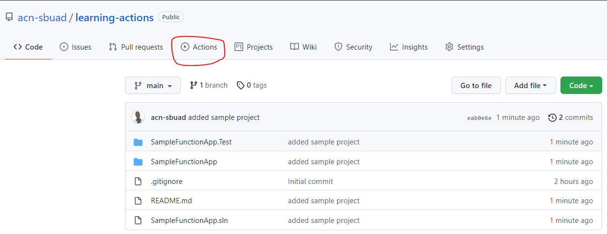


### Step 2 - Find the `.NET` workflow and select `Set up this workflow`.

  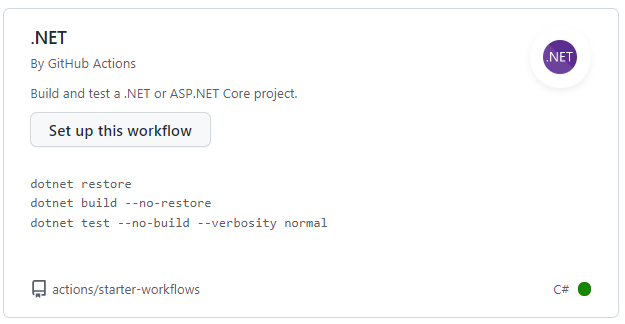

A yml file containing the workflow is automatically generated for you. 

> ⚠️ Note the path to the file **`.github/workflows`**. All workflows must be placed in this directory to be picked up by GitHub.

### Step 3 - Set the correct .NET version

The default build task for .NET provided by GitHub is configured to build .NET Core 5 solutions. As our solution runs with .NET 6, a change is required for the agent to have the correct SKDs installed.

Change line 19 from
```yml
dotnet-version: 5.0.x
```
to 
```yml
dotnet-version: 6.0.x
```

### Step 4 - Reflection

 Study the workflow file. Can you identify the key components? 

  - Which events does the workflow listen after? 
  - The runner defined, is it a self-hosted agent or a GitHub runner?
  - Could you think of another runner that could have been used? [Available runners](https://docs.github.com/en/actions/using-github-hosted-runners/about-github-hosted-runners)


### Step 5 - Save the workflow

Commit the file as shown in the picture below. Once completed, follow the workflow run from the `Actions` tab in GitHub.

  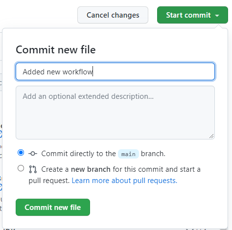

## ✏️ Task 2.2 - Customize the template workflow 

It is seldom the case that you can create a workflow based on a template 
and have it suit your needs out of the box. 

Let's go ahead and make some customizations for the workflow!

### Step 1 - Clone the repository to your local machine

Using your preferred tool, clone the forked repository to your local machine.
The following steps should be executed in a code editor, e.g. Visual Studio Code.

### Step 2 - Re-name the created yml file and workflow. 

When setting up workflows within larger projects, following a naming standard allows the developers to quickly identify what a workflow is related to.

The default workflow name in the template is `.NET`, which isn't necessarily very descriptive. 

The name of the workflow is declared in the first line of `dotnet.yml`.

**Give the workflow a suitable name and rename the file.**

### Step 3 - Remove the PR event trigger for the workflow

As this is a workshop for you to learn GitHub Actions,
we do not expect any pull requests for this repository.

**Simplify your workflow file by removing the pull request event, but leaving the push event for main.** 

### Step 4 - Add a scheduled event trigger for the workflow

GitHub Workflows supports scheduled events, meaning that you 
can trigger your workflow based on a schedule. This could be useful if there are weekly or daily tasks such as patching your code or closing stale issues.

Read up on [how to set up a scheduled event trigger](https://docs.github.com/en/actions/learn-github-actions/events-that-trigger-workflows#scheduled-events). 

**Can you schedule this workflow to trigger at the top of every hour, Monday - Friday?**


## Task 3 - Automating developer workflows

A great benefit to GitHub Actions is that it does not only support 
automation of CI/CD workflows. Workflows in GitHub allow us to automate
time consuming and error prone developer workflows, such as

- issue and pull request labeling
- assignment of issues and/or pull request to developers
- creation of release notes
- patching of dependencies

In task 3 we will explore some of the developer workflows that can be 
automated.


## ✏️ Task 3.1 

In projects with large code bases labels are often used for both issues and pull requests to identify which part of the solution they relate to. 

Below is an example of some issues from [Azure's repository azure-sdk-for-net](https://github.com/Azure/azure-sdk-for-net/issues). Notice the different labels assigned to each issue.

  


We will be setting up a workflow to automatically label pull requests based on the files that the PR modifies using an action from the GitHub Marketplace.


### Step 1 - Define the labels for the workflow to use

A prerequisite for the action we are using is a file that defines the labels and the files in the repository that each label applies to.

Create an empty file called `labeler.yml` in the `.github` folder
and copy the content below.

```yml
area/test:
  - 'SimpleFunctionApp.Test/*'

area/automation:
  - '.github/**/*'

area/development:
  - 'SimpleFunctionApp/*'
```

The file defines three labels for the repository. Below you find a description of 
each label.

|Label            |Description                  |
|-----------------|-----------------------------|
|area/test        | Covers all changes under the `SimpleFunctionApp.Test` directory |
|area/automation  | Covers all changes under the `.github` directory  |
|area/development | Covers all changes under the `SimpleFunctionApp` directory  |
--------

**Can you think of another abel to add to the repository?**

### Step 2 - Set up a workflow for automatic labeling on PR

In the `.github/workflows` folder create a new file and name it ``pr-labeler.yml`.
Copy the code below into the file.

```yml
name: Pull Request Labeler
on: [pull_request_target]

jobs:
  label:

    runs-on: ubuntu-latest

    steps:
    - name: Labeler
      uses: [insert correct action]
      with:
        repo-token: "${{ secrets.GITHUB_TOKEN }}"
```

This defines an action that triggers on the event of a pull requests. 
The key word `pull_request_target` differs from `pull_request` in that
the workflow will run in the context of the base of the pull request, rather than the merge commit. 

A single job `label` running on an `ubuntu-latest` runner defines a single step `Labeler` using a not yet defined action. The action is given access to a secret from the repository.


### Step 3 - Complete the workflow file

The workflow copied in step 2 is not valid. The action to use is missing.

Find the correct action to insert from [Github Marketplace for Actions](https://github.com/marketplace?type=actions).

>:balloon: Hint: The action is published by `actions` and we are working on adding a `Label` to a pull request.


### Step 4 - Create a PR to test the new workflow

In GitHub, navigate to `SampleFunctionApp.Test\FunctionsTest.cs`.

Enable editing of the file by clicking the pencil icon

  

Copy the code block below into the file.
```cs
[Fact]
 public async void HttpTriggerWithParams2()
 {
     var request = TestFactory.CreateHttpRequest("name", "Nancy");
     var response = (OkObjectResult)await Function1.Run(request, logger);
     Assert.Equal("Hello Nancy! Welcome to Azure Functions!", response.Value);
 }
```

Your file should look like this after adding the new test.

```cs
// ommited using statements

namespace SampleFunctionApp.Test
{
    public class Function1Test
    {
        private readonly ILogger logger = NullLoggerFactory.Instance.CreateLogger("Null Logger");

        [Fact]
        public async void HttpTriggerWithParams()
        {
            var request = TestFactory.CreateHttpRequest("name", "Bill");
            var response = (OkObjectResult)await Function1.Run(request, logger);
            Assert.Equal("Hello Bill! Welcome to Azure Functions!", response.Value);
        }
           
        [Fact]
         public async void HttpTriggerWithParams2()
         {
             var request = TestFactory.CreateHttpRequest("name", "Nancy");
             var response = (OkObjectResult)await Function1.Run(request, logger);
             Assert.Equal("Hello Nancy! Welcome to Azure Functions!", response.Value);
         }
        
        [Fact]
        public async void HttpTriggerWithoutParams()
        {
            var request = TestFactory.CreateHttpRequest("", "");
            var response = (OkObjectResult)await Function1.Run(request, logger);
            Assert.Equal("Hello there! Welcome to Azure Functions!", response.Value);
        }
    }
}

```

Make sure to give the change a descriptive name, select the `create a new branch`
option and complete the pull request creation.

  

Once the PR is create, follow the workflow run from the `Actions` tab in GitHub, and confirm that the PR is successfully labeled.

## Task 4 - Integration with static code analysis tool

In task 4 we will integrate our workflow with [SonarCloud](https://sonarcloud.io/) and trigger code analysis of our solution.


## ✏️ Task 4.1 - Setting up a SonarCloud account and project

### Step 1 - Log onto Sonarcloud
Open the [SonarCloud site](https://sonarcloud.io/) in a browser and log in with your GitHub credentials.

### Step 2 - Set up a new SonarCloud project

1. In the top left corner select the `+` icon and select `Analyze new project`.

    

2. On the next page select organization, there should be an organization matching your GitHub username.

3. Select the repository you are working with.

4. Set up the project as a public project

    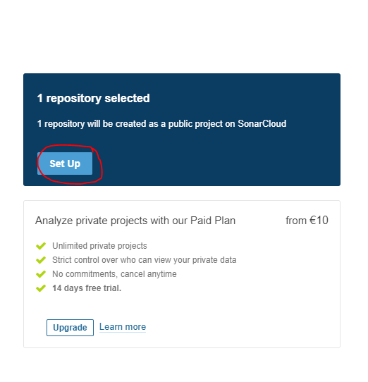

    If successfull, you should be redirected to the landing page of the project. 
    It should look something like this:

    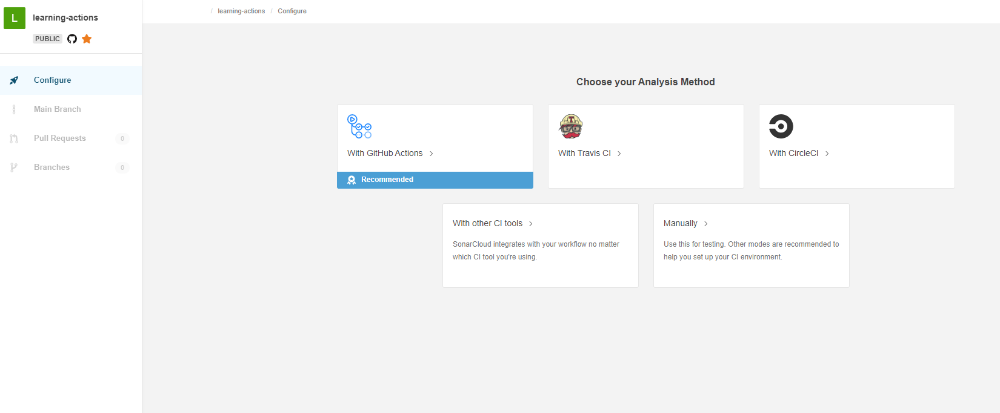

### Step 3 - Configure the SonarCloud project

1. On the project page, select `GitHub Actions` as your analysis method.
    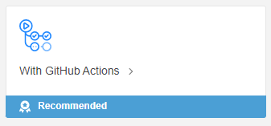

    You will be presented with a secret that should be created in your repository.
    We will reference back to these values, so keep the tab open in your browser.    
    
    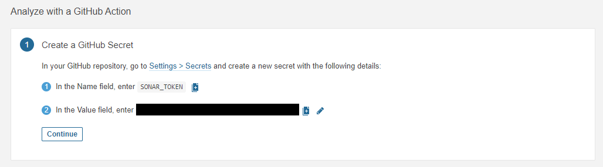
 
 2. In a new tab in your browser, navigate to the secrets section of your forked workshop repository.

    - Select Settings in the top menu of the repository
    - Select Secrets in the left side menu 
    - Click `new repository secret`

    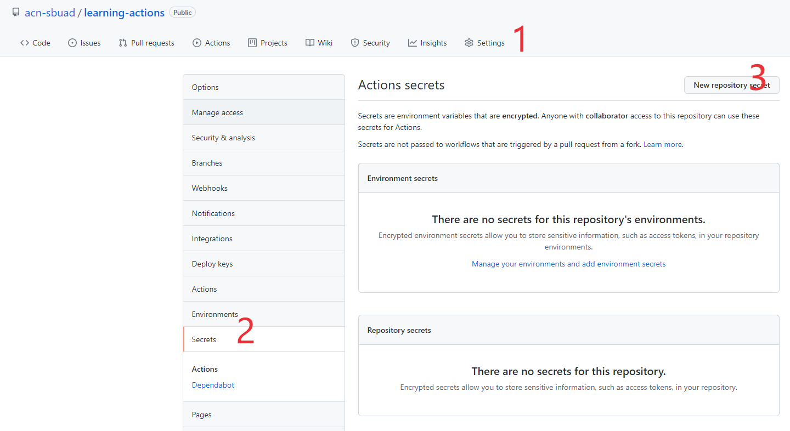

3. Referring back to the values in SonarCloud, create a new secret in your repository.
    Complete the secret setup by clicking `Add secret`.

    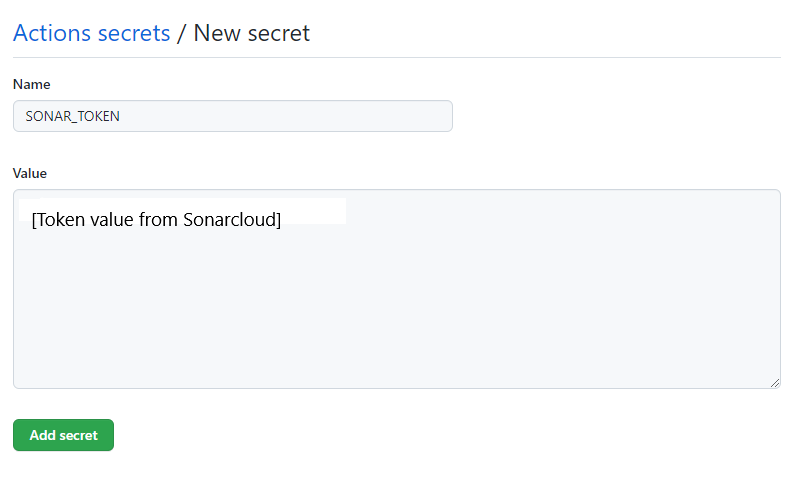

4. If the creation was successfull, your secret shuld be diplayed under repository secrets at the bottom of the page.

    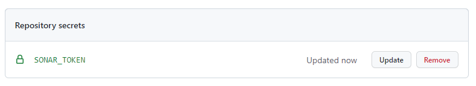

### Step 4 - Set up the GitHub workflow 

1. Start by creating a new empty file in your code editor under the `.github/workflows`
folder. Name the file `dotnet-analysis.yml`.

2. Navigate back to SonarCloud and the configuration of analysis page.

    Click `Continue` to display the second step.
    
    This should display different build types.
    
    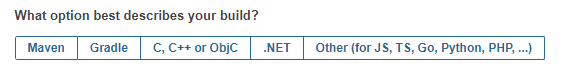
    
    Select `.NET`.

3. Copy the provided template workflow into the file you just created.

4. Change the name of the workflow to `.NET Analysis`

5. Change the branch trigger from `master` to `main`

    If you're anything like me, and apparently SonarCloud, 
    it might seem like yesterday that GitHub started to name their main branches `main`.
    This actually happened in October 2020, and I'm still having a hard time remembering to check out main instead of master. Anyways, back to the task at hand! 

6. Change the runner to `windows-2022`

    As we are running a .NET 6 project, we need to use a runner with the .NET 6 SDK installed, or install it manually. We are opting for the first option.

7. On the second to last line add the following code. 
    Replace the placeholder `<insert_your_build_command>` 
    with `dotnet build`

### Step 5 - Review the workflow

You complete workflow file should look something like this.

  ```yml
  name: .NET Analysis
  on:
    push:
      branches:
        - main
    pull_request:
      types: [opened, synchronize, reopened]
  jobs:
    build:
      name: Build
      runs-on: windows-2022
      steps:
        - name: Set up JDK 11
          uses: actions/setup-java@v1
          with:
            java-version: 1.11
        - uses: actions/checkout@v2
          with:
            fetch-depth: 0  # Shallow clones should be disabled for a better relevancy of analysis
        - name: Cache SonarCloud packages
          uses: actions/cache@v1
          with:
            path: ~\sonar\cache
            key: ${{ runner.os }}-sonar
            restore-keys: ${{ runner.os }}-sonar
        - name: Cache SonarCloud scanner
          id: cache-sonar-scanner
          uses: actions/cache@v1
          with:
            path: .\.sonar\scanner
            key: ${{ runner.os }}-sonar-scanner
            restore-keys: ${{ runner.os }}-sonar-scanner
        - name: Install SonarCloud scanner
          if: steps.cache-sonar-scanner.outputs.cache-hit != 'true'
          shell: powershell
          run: |
            New-Item -Path .\.sonar\scanner -ItemType Directory
            dotnet tool update dotnet-sonarscanner --tool-path .\.sonar\scanner
        - name: Build and analyze
          env:
            GITHUB_TOKEN: ${{ secrets.GITHUB_TOKEN }}  # Needed to get PR information, if any
            SONAR_TOKEN: ${{ secrets.SONAR_TOKEN }}
          shell: powershell
          run: |
            .\.sonar\scanner\dotnet-sonarscanner begin /k:"acn-sbuad_learning-actions" /o:"acn-sbuad" /d:sonar.login="${{ secrets.SONAR_TOKEN }}" /d:sonar.host.url="https://sonarcloud.io"
            dotnet build
            .\.sonar\scanner\dotnet-sonarscanner end /d:sonar.login="${{ secrets.SONAR_TOKEN }}"
  ```
  Let's go through each section of the file.

  ```yml
  name: .NET Analysis
  on:
    push:
      branches:
        - main
    pull_request:
      types: [opened, synchronize, reopened]
  ```

  In the first few lines of the file, the name of the workflow and events are defined.
  This workflow is triggered every time code is pushed to the `main` branch.
  In addition, the workflos is triggered whenever a pull request is `opened`, `synchronized`, or `reopened`.

  ```yml
  jobs:
    build:
      name: Build
      runs-on: windows-2022
  ```
  Next, the job `build` with the display name `Build` is defined.
  The workflow is set up to use a `windows-2022` runner to ensure we have the .NET 6 SDK available.
  
  The latter part of the yml file defines six steps.

  ```yml
 - name: Set up JDK 11
   uses: actions/setup-java@v1
   with:
     java-version: 1.11
  ``` 
  This step sets up the required JDKs for running SonarCloud on the runner.
  The display name `Set up JDK 11` is defined before it specifies to use an action from the GitHub Marketplace `actions/setup-java@v1` for setting up the required JDK version

  ```yml
  - uses: actions/checkout@v2
    with:
      fetch-depth: 0 
  ```

  The next step does not set a display name, but it is a step you will get very familiar with when working with workflows. It checks out you repository, so your workflow can access it.

  `fetch-depth` is set to 0 to enable fetching of all history for all branches and tags.

  ```yml
  - name: Cache SonarCloud packages
    uses: actions/cache@v1
    with:
      path: ~\sonar\cache
      key: ${{ runner.os }}-sonar
      restore-keys: ${{ runner.os }}-sonar
  - name: Cache SonarCloud scanner
    id: cache-sonar-scanner
    uses: actions/cache@v1
    with:
      path: .\.sonar\scanner
      key: ${{ runner.os }}-sonar-scanner
      restore-keys: ${{ runner.os }}-sonar-scanner
  - name: Install SonarCloud scanner
    if: steps.cache-sonar-scanner.outputs.cache-hit != 'true'
    shell: powershell
    run: |
      New-Item -Path .\.sonar\scanner -ItemType Directory
      dotnet tool update dotnet-sonarscanner --tool-path .\.sonar\scanner
  ```

  Three steps related to setting up SonarCloud follow. We won't go into detail here, as the benefit of using a ready template is not having to know the intricate details of every step that you utilize. SonarCloud keeps track of this for us!
  
  ```yml
  - name: Build and analyze
    env:
      GITHUB_TOKEN: ${{ secrets.GITHUB_TOKEN }}  # Needed to get PR information, if any
      SONAR_TOKEN: ${{ secrets.SONAR_TOKEN }}
    shell: powershell
    run: |
      .\.sonar\scanner\dotnet-sonarscanner begin /k:"acn-sbuad_learning-actions" /o:"acn-sbuad" /d:sonar.login="${{ secrets.SONAR_TOKEN }}" /d:sonar.host.url="https://sonarcloud.io"
      dotnet build
      .\.sonar\scanner\dotnet-sonarscanner end /d:sonar.login="${{ secrets.SONAR_TOKEN }}"
  ```

  The final step in the job, and workflow builds and analyses our project. 
  Two secrets are used: `${{ secrets.GITHUB_TOKEN }}` and `${{ secrets.SONAR_TOKEN }}`.
  The SONAR_TOKEN you created yourself a few tasks back. The GITHUB_TOKEN is available for the workflow and grants the workflow [a number of permissions](https://docs.github.com/en/actions/security-guides/automatic-token-authentication#permissions-for-the-github_token). 

    
### Step 6 - Trigger SonarCloud analysis

Now that our workflow is complete, let's push the code to main and see how it runs!

  > ❓ What event can you trigger for the code analysis to run? 

Follow the analysis workflow in the `actions` tab. Once completed, navigate back to SonarCloud. 

If the workflow ran successfully, you should be able to see a report generated for the state of your main branch, and any pull request that triggered the analysis.

  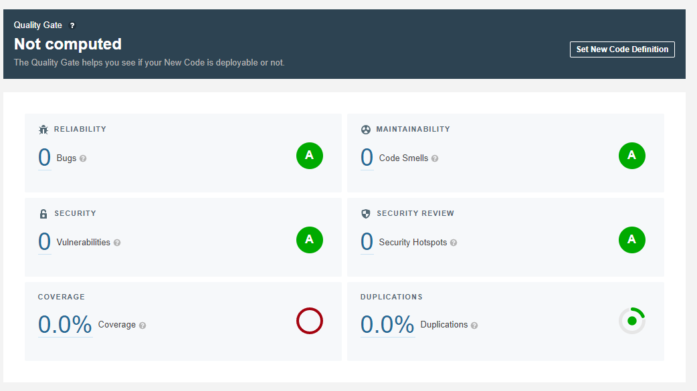


## Final Reflection

In this workshop, we have mainly worked with workflows supporting/enabling CI.
The CD part of it is left up to you! Which workflow and actions would you need to deploy the Function App to Azure? Figuring this out could be your next task and a way to dig deeper into the topics of this workshop.

Thanks for participating, and good luck on your development journey!

### Further reading

There are many resources available online for learning more about workflows. A good starting point would be [GitHub's own documentation](https://docs.github.com/en/actions).


And don't forget to set aside time to dive into the heaps of actions to explore in [GitHub Marketplace](https://github.com/marketplace?type=actions). 


  > ⚠️ Warning: Always perform your due diligence when including an action that is not from a verified creator or published by GitHub itself (these actions alway begin with `actions/` e.g. `actions/checkout`).
